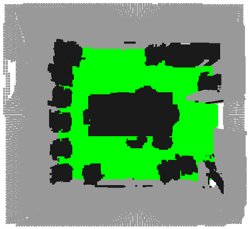
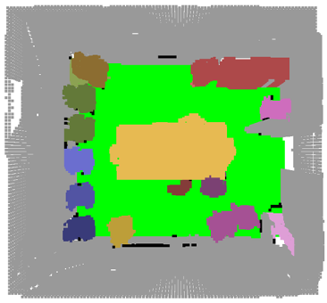
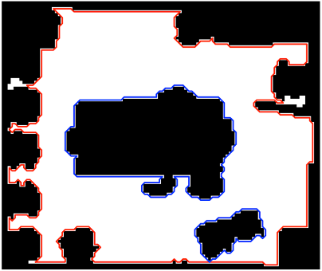
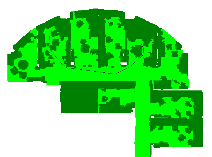

# 3D Computational Geometry & Computer Vision - Path Planning Project

This project focuses on the analysis and processing of indoor scenes using data from the [Stanford 3D Indoor Spaces Dataset (S3DIS)](http://buildingparser.stanford.edu/dataset.html). In the first part, plane detection was used to identify the walls, floor, and ceiling of a closed room, and interior objects were isolated using initial data consisting of a mesh of the scene. Sampling was implemented to create a point cloud with a uniform distribution of points, where the plane detection method was applied again to isolate the interior objects. In the second part, a clustering algorithm was developed and applied to identify objects in the room. Additionally, an algorithm was developed for calculating the optimal path between two points within the room, as well as within a floor consisting of multiple rooms, taking into account the complete geometry of the space.

## Preprocessing

In this part a voxel grid was created assigning values on each voxel based on the normal vector direction from the initial data.

## Plane detection

Various sweeps are performed on the voxel-grid to reconstruct the rooms structural elements and then RANSAC algorithm was used to identify the walls of the room, isolating the objects inside the room.

## Uniform Sampling

A uniform sampling algorithm was implemented to sample a point cloud from the initial room mesh.
The resulting point cloud was then used as initial data for the same preprocessing method, creating the same result

## Object Clustering

After the internal objects were isolated, DBSCAN was used to cluster the interior objects as shown bellow.

## Path Planning

The object clusters were projected to the floor. Then the reachable area was represented by polygons. The path was calculated avoiding these polygons.

The developed algorithm called "visipath" is a recursive algorithm calculating the near optimal path between two points based on visibility graph concepts.

